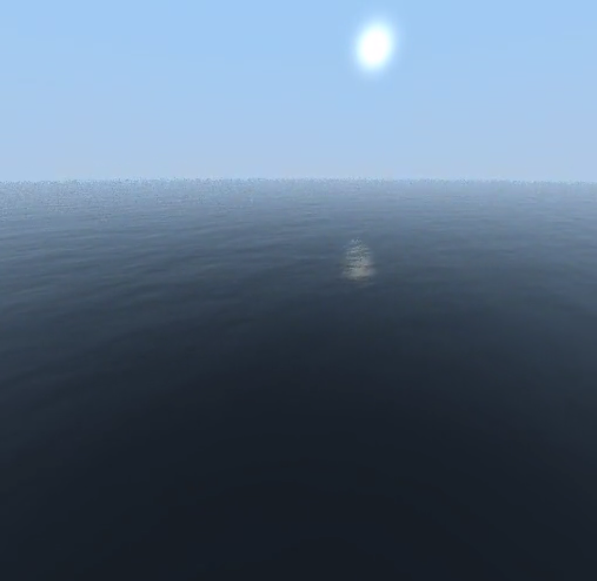

# OceanMarcher

OceanMarcher is a ray marching technique that employs a Fast Fourier Transform (FFT) to calculate a height map, resulting in realistic ocean rendering. This readme provides an overview of the requirements and setup process for running OceanMarcher on your system. The implementation of OceanMarcher is based on the groundbreaking work of Jerry Tessendorf as described in his article on ocean simulation.

## Requirements
Before proceeding with the setup, ensure that the following software is installed on your system:
> `cpp`: The C++ programming language compiler. OceanMarcher is written in C++, and a compatible compiler is required to build the application.
> 
> `ffmpeg`: A powerful multimedia framework that includes various libraries and utilities for handling audio, video, and other media files. It is used in OceanMarcher for video output.
> 
> `CMake`: A cross-platform build system that simplifies the process of building and managing projects. OceanMarcher uses CMake to generate platform-specific build files.

Please make sure these dependencies are installed and properly configured on your system before proceeding to the next steps.

## Setup
To set up OceanMarcher on your system, follow these steps:

* Clone the OceanMarcher repository from the source code repository.
  
  Alternatively, you can download the source code as a ZIP archive and extract it to a local directory.

* Navigate to the OceanMarcher directory.

  ```cd OceanMarcher```

* Create a build directory and navigate into it.

  ```mkdir build && cd build```

* Run CMake to generate the build files.

  ```cmake ..```

  This command configures the build system based on the CMakeLists.txt file found in the project's root directory.

* Build OceanMarcher using the generated build files.

  ```cmake --build .```

  This command compiles the source code and creates the executable file for OceanMarcher.

* Verify that the build process was successful by running the OceanMarcher executable.

  ```./OceanMarcher```

  If everything was set up correctly, the application should start running, generating a realistic ocean rendering using the ray marching technique with FFT-based height map calculation.

* Optionally, if you want to output the rendering as a video, make sure ffmpeg is installed on your system. Then, modify the source code to include the necessary video output functionality.      Finally, rebuild the application using the steps outlined in steps 4 and 5.

## Image Examples




